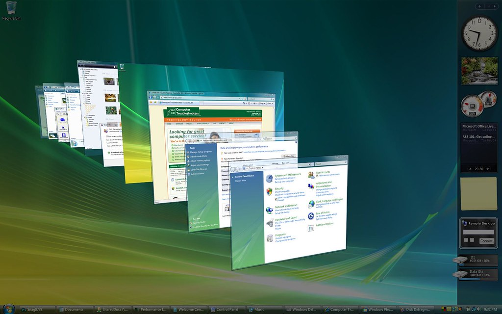

# WinFlipped
WinFlipped is an attempt to mimic the functionality of Flip3D (available on Windows Vista/7) on Windows 10/11.

It works by screen grabbing all available windows (meaning that there are no live window thumbnails, unfortunately). For security and privacy reasons, screenshots are not saved anywhere. 

This is not a perfect Flip3D replacement, but as far as I know, there is no better way, since Windows does not provide a good API for this (If you know one, please contact me).

This is a WPF program, running on .NET 8.0.

This project is currently a WIP.
# What is Flip3D?
According to [www.pcmag.com](https://www.pcmag.com/encyclopedia/term/flip-3d):

Flip3D is *"a feature of the earlier Aero interface in Windows that displayed the desktop and open apps in 3D. 
Pressing Windows key + Tab key invoked Flip 3D, and continually pressing Windows-Tab rotated the windows from back to front."*

# Usage
- You can assign a key combination to launch this program, using tools like AutoHotKey, for instance.
- Press `TAB` to cycle through windows, and `ENTER` to switch to the selected one.
# Contributing to this project
Suggestions are greatly appreciated.

My main concerns at the moment are:
- Finishing animation
- Improving performance
- Finding new ways of getting open windows (Ghost windows show up while child windows might be missing)
- Finding new ways of getting window thumbnails, as some programs use GPU rendering, meaning that they will show up blank.
# License
[MIT](./LICENSE)